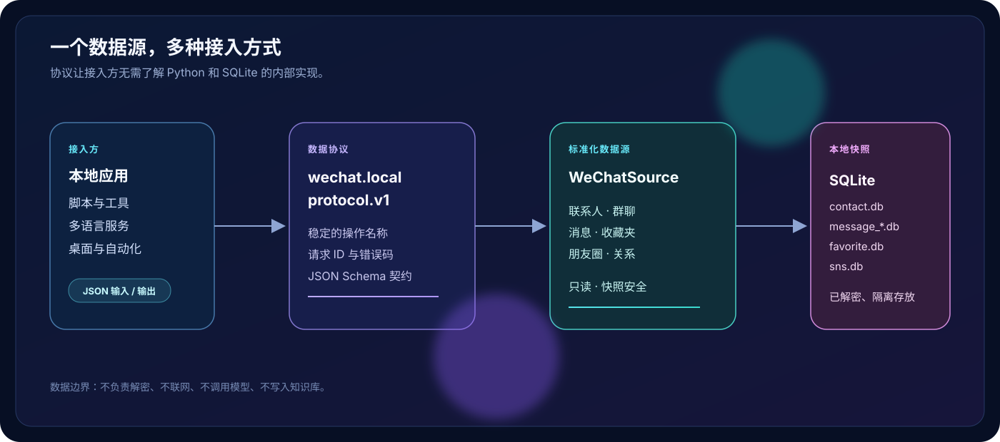

<div align="center">
  

  <p><strong>通用的本地微信数据接口</strong></p>
  <p>把已解密的微信 SQLite 快照，转换成可检索、可导出、可跨语言接入的标准化对象。</p>

  <p>
    <kbd>Python 3.10+</kbd>
    <kbd>MIT</kbd>
    <kbd>read-only</kbd>
    <kbd>local-first</kbd>
    <kbd>protocol v1</kbd>
  </p>
</div>

<br />

> **一句话介绍**：这是一个不碰微信进程、不访问网络、不写入知识库的本地接口层。它读取稳定的解密快照，统一输出联系人、群聊、消息、收藏夹、朋友圈和关系数据。

## 为什么需要这一层

微信数据库适合存储，不适合直接作为产品接口。下游程序不应该了解 SQLite 表名、微信内部整数类型、消息分片或不同版本的字段差异。

这个项目负责把底层数据整理成稳定对象：

| 原始世界 | 统一世界 |
| --- | --- |
| `contact.db`、`message_*.db`、`sns.db` | `actor`、`conversation`、`message`、`moment` |
| SQLite 整数、内部表名、分片 | 来源隔离的字符串 ID |
| Python 方法和异常 | JSON / NDJSON 请求、响应和错误码 |
| 群成员表、消息发言人 | `member_of`、`owns` 关系边 |

## 架构

<p align="center">
  
</p>

Python 是当前实现语言，但不是集成边界。TypeScript、Go、Rust、Swift 或其他程序都可以通过相同的 JSON 协议接入。

## 能力地图

| 模块 | 数据来源 | 可做什么 |
| --- | --- | --- |
| 联系人 | `contact/contact.db` | 联系人搜索、好友状态、公众号识别、稳定 `actor_id` |
| 群聊关系 | `chat_room`、`chatroom_member` | 群成员、群主、好友/陌生人分类、共同群、关系边 |
| 聊天记录 | `message_*.db`、`biz_message_*.db` | 读取、搜索、时间/作者/类型/方向过滤、完整导出 |
| 消息资源 | `message_resource.db` | 文件名、大小等索引元数据，不读取文件本体 |
| 收藏夹 | `favorite/favorite.db` | 文本、图片、文章、名片、视频号的读取、搜索和导出 |
| 朋友圈 | `sns/sns.db` | 正文、标题、链接和媒体元数据的读取、搜索和导出 |
| 统一协议 | `schemas/` | 跨语言请求、响应、记录和错误契约 |

### 对象关系

所有对象通过稳定 ID 连接：

```text
actor ── member_of ──▶ conversation
actor ───── owns ─────▶ conversation
message ─ authored_by ─▶ actor
message ─ belongs_to ──▶ conversation
favorite / moment ─────▶ actor
```

群成员结果会明确区分：

- `friend`：本地快照标记为通讯录好友；
- `non_friend`：本地快照标记为群内陌生人；
- `unknown`：缺少可判断字段；
- `self`：当前账号。

`in_contact_database` 只表示存在联系人行，不能单独当作好友结论。

## 获取已解密快照

本项目需要一个已经解密的微信数据库快照。可以使用外部的 [`yichen-wechat-local-vault` Skill](https://github.com/mcncarl/yichen-skills/tree/main/yichen-wechat-local-vault) 完成 Mac 微信数据库的密钥提取、全量解密和增量刷新，再把稳定快照目录传给本项目。

两个项目保持独立：本仓库不复制、调用或重新实现解密代码。使用外部 Skill 时，请遵守它的许可证、使用说明以及适用的法律和平台规则。

## 安装

```bash
git clone https://github.com/Ethan-Wang-dev/wechat-local-interface.git
cd wechat-local-interface

python3 -m venv .venv
. .venv/bin/activate
python -m pip install -e '.[zstandard]'
```

`zstandard` 是可选依赖。快照含有 zstd 压缩消息时需要安装；普通文本快照不需要。

## 30 秒开始使用

所有命令都需要一个稳定快照目录和逻辑来源 ID：

```bash
wechat-local-interface \
  --snapshot ./wechat-snapshot \
  --source-id my-wechat \
  status
```

常用查询：

```bash
# 联系人、群聊和公众号
wechat-local-interface --snapshot ./wechat-snapshot --source-id my-wechat contacts --query "张三"
wechat-local-interface --snapshot ./wechat-snapshot --source-id my-wechat conversations --kind group
wechat-local-interface --snapshot ./wechat-snapshot --source-id my-wechat official --query "公众号"

# 群成员、好友状态和对象关系
wechat-local-interface --snapshot ./wechat-snapshot --source-id my-wechat members CONVERSATION_ID --friend
wechat-local-interface --snapshot ./wechat-snapshot --source-id my-wechat contact-groups ACTOR_ID
wechat-local-interface --snapshot ./wechat-snapshot --source-id my-wechat common-groups ACTOR_ID_1 ACTOR_ID_2
wechat-local-interface --snapshot ./wechat-snapshot --source-id my-wechat relations --type owns

# 消息、收藏夹、朋友圈和跨资源搜索
wechat-local-interface --snapshot ./wechat-snapshot --source-id my-wechat search "项目" --kind link
wechat-local-interface --snapshot ./wechat-snapshot --source-id my-wechat favorites --query "文章"
wechat-local-interface --snapshot ./wechat-snapshot --source-id my-wechat moments --has-link
wechat-local-interface --snapshot ./wechat-snapshot --source-id my-wechat search "关键词" --scope all
```

## 语言无关协议

其他非 Python 程序使用 JSON/NDJSON 通道，不需要导入 Python 包：

```bash
wechat-local-interface \
  --snapshot ./wechat-snapshot \
  --source-id my-wechat \
  rpc < requests.ndjson > responses.ndjson
```

请求使用 `protocol_version`、`request_id`、`operation`、`params`；响应使用 `ok`、`data`/`error` 和 `meta`。

示例请求：

```json
{
  "protocol_version": "wechat.local.protocol.v1",
  "request_id": "req-0001",
  "operation": "groups.members",
  "params": {
    "conversation_id": "conversation_<hash>",
    "is_friend": true,
    "limit": 100
  }
}
```

机器可读契约和错误码见 [`docs/protocol.md`](docs/protocol.md)：

- [`wechat.local.protocol.v1.json`](schemas/wechat.local.protocol.v1.json)：请求/响应信封；
- [`wechat.local.operations.v1.json`](schemas/wechat.local.operations.v1.json)：全部操作及参数；
- [`wechat.local.records.v0.json`](schemas/wechat.local.records.v0.json)：actor、conversation、message、relationship 等记录。

## Python API

Python 调用适合本地插件和脚本：

```python
from wechat_local_interface import WeChatSource

source = WeChatSource(
    snapshot="/path/to/decrypted/current",
    source_id="my-wechat",
    account_username="my-account",  # 可选：用于判断收发方向
)

groups = source.list_conversations(kinds=["group"])
if groups:
    members = source.list_group_members(groups[0]["id"], is_friend=True)

results = source.search_all(
    "项目",
    scopes=["messages", "favorites", "moments"],
)
```

完整规范：

- [`docs/interface.md`](docs/interface.md)：Python API、CLI、过滤器、分页和导出；
- [`docs/protocol.md`](docs/protocol.md)：跨语言协议和对象模型。

## 设计边界

- 只接受已经解密的 Mac 4.x 离线快照；
- 以 SQLite `mode=ro&immutable=1` 打开源数据库；
- 拒绝符号链接和活动的 `-wal`、`-shm`、`-journal` 文件；
- 不连接微信进程，不访问 URL，不下载媒体，不调用网络或模型；
- 不写入知识库，不改变源数据库；
- 导出目录默认 `0700`，导出文件默认 `0600`；
- 收藏夹和朋友圈数据库缺失时，消息和联系人接口仍可使用；
- 缺少群成员表时，会降级为消息中观察到的发言人，并标记 `complete: false`。

## 开发

```bash
PYTHONPATH=src python3 -m unittest discover -s tests -q
PYTHONPATH=src python3 -m compileall -q src
```

## License

MIT License。项目不包含微信解密代码，也不包含任何真实微信数据库或用户数据。
