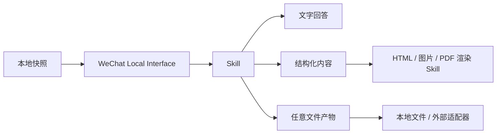

# Skill 架构

本项目的底层接口负责读取和查询本地微信数据。Skill 负责完成具体任务，输出可以是回答、结构化数据、Markdown、HTML、图片、PDF 或一组文件。

Skill 不需要遵循固定的功能分类，也不要求使用特定的模型或编程语言。Gallery 只需要知道它能做什么、需要读取什么、可能写入什么，以及会生成哪些产物。

## 工作链路



Skill 可以直接生成最终文件，也可以先生成可组合的结构化内容，再交给其他 Skill 渲染。两种方式都属于有效实现。

## 数据新鲜度前置规则

凡是会读取微信本地数据的 Skill，**开始查询前必须先刷新一次数据**。默认刷新是
Mac 本地 Vault 的增量解密，不是每次全量重建：

```bash
python3 {{YICHEN_SKILL_DIR}}/scripts/decrypt_all_dbs.py --mode incremental
```

随后 Skill 必须使用刷新完成后生成的稳定快照，并在结果中记录刷新时间或快照版本。
刷新失败、没有新增数据或快照仍有活动 `-wal/-shm/-journal` 时，应明确告诉调用方，
不能悄悄使用旧数据冒充最新结果。

以下情况可以跳过增量刷新，但必须记录原因：

- 输入是用户明确提供的离线快照，Skill 无法访问原始微信库；此时先执行结构验证；
- Skill 只处理上一个 Skill 已生成的 JSON/Markdown/图片，不再读取微信数据；
- 用户明确要求离线复现一个历史快照。

“刷新一次”只保证读取入口尽量接近当前状态，不代表网络同步、消息一定已送达，或被
删除/撤回的数据可以恢复。刷新动作应在 Skill 的 `工作流程` 和 `skill.yaml` 中声明，
并且不能把密钥、明文数据库或增量状态复制到 Skill 目录。

## 输入和输出

输入不是固定的数据类型，而是一次任务可以使用的资源集合：

- 用户的自然语言目标和参数；
- 本地微信接口返回的记录；
- 用户明确提供的文件或目录；
- 其他 Skill 的结果；
- 已安装的本地工具和模型。

输出也保持开放。Skill 可以返回：

- 对话回复；
- JSON、CSV、JSONL 等结构化数据；
- Markdown、HTML、纯文本；
- SVG、PNG、PDF、音频或视频；
- 一个包含多个文件的报告目录；
- 写入用户指定的本地应用或知识库。

## 可选的内容封装

需要被其他 Skill 继续处理时，可以使用 [`wechat.content.v1`](../schemas/wechat.content.v1.json) 封装结果。它只规定通用元数据和产物引用，`payload` 的具体结构由 Skill 自己定义。

```json
{
  "schema": "wechat.content.v1",
  "kind": "conversation_insight",
  "title": "群聊分析",
  "payload": {
    "summary": "这里由具体 Skill 定义",
    "sections": []
  },
  "evidence": [],
  "artifacts": [
    {
      "path": "report.html",
      "media_type": "text/html"
    }
  ]
}
```

不使用这个封装也可以。直接输出 HTML、图片或其他文件时，只需要在 Skill 文档中说明产物位置和格式。

## 能力清单

每个 Skill 可以在可选的 `skill.yaml` 中声明：

```yaml
name: replace-me
version: 0.1.0
description: 用一句话说明这个 Skill 解决什么问题
triggers:
  - 用户可能怎样提出请求
reads:
  - wechat.messages
writes:
  - local_files
outputs:
  - media_type: text/markdown
    description: 人工可读的报告
network: false
refresh_before_read: true
```

这些字段用于 Gallery 展示、权限提示和搜索，不构成运行时类型限制。`tags`、`reads`、`writes` 和 `outputs` 都可以按 Skill 需要扩展。
